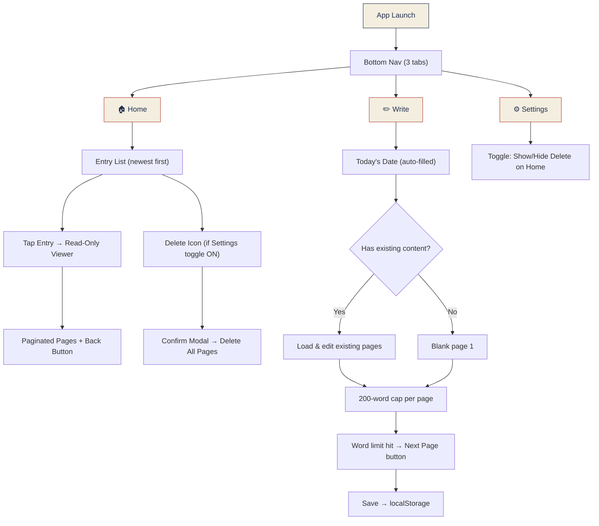
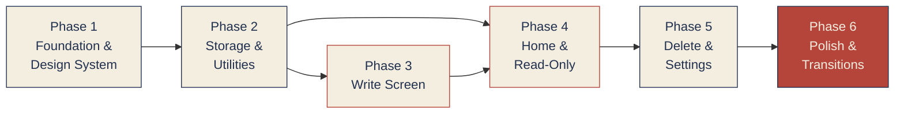

# Dear Diary — Implementation Plan

## Project Summary

A personal, offline-only diary app with a warm notebook/typewriter aesthetic. One entry per day, 200-word pages, only today is editable, all past entries are permanently locked.

**Decisions locked in:**
- Tailwind CSS (overriding spec's plain CSS)
- localStorage for now (SQLite + Capacitor later)
- Paginated read-only viewer (one page at a time with transitions)
- Local timezone for "today" determination

---

## App Flow



---

## File Structure (Final)

```
/src
  /components
    BottomNav.jsx          ← 3-tab nav (Home, Write, Settings)
    HomeList.jsx           ← Entry list screen
    HomeEntryRow.jsx       ← Single date row in the list
    DeleteConfirmModal.jsx ← "Are you sure?" popup
    WritePage.jsx          ← Ruled-paper editor (today only)
    ReadOnlyViewer.jsx     ← Paginated past-entry viewer
    SettingsScreen.jsx     ← Delete toggle
    PageIndicator.jsx      ← "Page 1 of 3" dots/numbers
  /db
    storage.js             ← localStorage CRUD (swap to SQLite later)
  /hooks
    useEntries.js          ← Custom hook wrapping storage operations
  /utils
    date.js                ← Today check, formatting (native Date)
    words.js               ← Word counting & cap enforcement
  App.jsx                  ← Router / screen state manager
  main.jsx                 ← React root
  index.css                ← Tailwind + custom theme tokens
```

---

## Phases

### Phase 1 — Foundation & Design System
> **Goal:** Tailwind config, fonts, colors, base layout — the app "feels right" before any logic.

| File | What to do |
|---|---|
| `index.css` | Tailwind import + custom theme: cream bg `#F4EEE0`, ink navy `#22314F`, accent red `#B5443A`, paper grain noise overlay, ruled-line vars |
| `index.html` | Add Google Fonts: **Special Elite** (typewriter) + **Lora** (serif UI) |
| `App.jsx` | Set up screen state (`home` / `write` / `settings` / `read`), render shell with BottomNav |
| `BottomNav.jsx` | 3-tab bar: Home, Write, Settings — highlighted active tab, hidden on Write screen |

**Deliverable:** App shell with bottom nav, correct fonts & colors, cream paper background with subtle noise texture. No data yet.

---

### Phase 2 — Storage Layer & Utilities
> **Goal:** All data logic works independently of UI. Test via console if needed.

| File | What to do |
|---|---|
| `storage.js` | `getAllEntries()`, `getEntryByDate(date)`, `savePage(date, pageNum, content)`, `deleteEntry(date)` — all backed by `localStorage`, keyed as `diary_YYYY-MM-DD_pageN` |
| `date.js` | `getToday()` → `YYYY-MM-DD`, `isToday(dateStr)` → boolean, `formatDisplayDate(dateStr)` → human-readable (e.g. "Monday, 21 July 2026") |
| `words.js` | `countWords(text)` → number, `isAtWordLimit(text, limit=200)` → boolean, `truncateToWordLimit(text, limit=200)` → trimmed text |
| `useEntries.js` | React hook: exposes `entries`, `todayEntry`, `savePage`, `deleteEntry`, `loadEntry` — abstracts storage calls and re-renders |

**Deliverable:** Full CRUD working in localStorage. All date/word utilities tested.

---

### Phase 3 — Write Screen (Core Feature)
> **Goal:** The heart of the app — ruled paper editor for today's entry.

| File | What to do |
|---|---|
| `WritePage.jsx` | Ruled-paper textarea: horizontal lines at line-height intervals, red margin rule on left, page-turn transition between pages |
| | Auto-fill today's date at top (display only, not editable) |
| | Load existing content if today has saved pages |
| | Live word counter (e.g. "142 / 200") |
| | Block typing at 200 words — show "Next Page" button |
| | Multi-page support: page indicator, Prev/Next navigation |
| | Top bar: Back (left) → returns to Home, Save (right, accent red) → writes to storage |
| `App.jsx` | Wire Write screen: hide BottomNav, show top bar instead |

**Deliverable:** Can write, paginate, save, and re-open today's entry. Ruled paper looks like a real notebook.

---

### Phase 4 — Home Screen & Read-Only Viewer
> **Goal:** Browse past entries, read them in a locked paginated viewer.

| File | What to do |
|---|---|
| `HomeList.jsx` | List all dates with entries, newest first. Each row shows formatted date |
| `HomeEntryRow.jsx` | Single row: date text, conditional delete icon (only if settings toggle on) |
| `ReadOnlyViewer.jsx` | Opens when tapping a past entry. Paginated (one page at a time), page-turn transition, Back button. No edit controls. Slightly desaturated look + ink-stamp "locked" indicator |
| `PageIndicator.jsx` | "Page 1 of 3" or dot indicators for multi-page entries |
| `App.jsx` | Wire Home → ReadOnlyViewer navigation, pass selected date |

**Deliverable:** Full entry browsing with beautiful locked/archival look. Page-turn transitions between pages.

---

### Phase 5 — Delete Flow & Settings
> **Goal:** Delete entries with confirmation, toggle delete visibility from Settings.

| File | What to do |
|---|---|
| `SettingsScreen.jsx` | Single toggle: "Show delete option on Home". Persist in localStorage. Default: OFF |
| `DeleteConfirmModal.jsx` | Modal overlay: "Delete this entry permanently? This cannot be undone." Confirm / Cancel buttons |
| `HomeEntryRow.jsx` | Conditionally render delete icon based on settings toggle |
| `HomeList.jsx` | Wire delete confirmation → `storage.deleteEntry()` → refresh list |

**Deliverable:** Full delete flow with confirmation. Settings toggle works and persists.

---

### Phase 6 — Polish & Transitions
> **Goal:** Final visual polish — the app feels premium and intentional.

| Task | Details |
|---|---|
| Page-turn transitions | CSS/JS animation for Home↔Write and between pages (subtle flip or fade-slide) |
| Paper noise texture | SVG/CSS noise filter overlay on cream background |
| Locked entry styling | Desaturated past entries, ink-stamp "🔒 Locked" mark |
| Empty states | "No entries yet" on Home, first-time writing prompt |
| Responsive | Works well on mobile viewport (primary target is Android via Capacitor) |
| Edge cases | Midnight rollover (writing at 11:59pm), empty pages cleanup, word count on paste |

**Deliverable:** Polished, ship-ready web app. Ready for Capacitor wrapping later.

---

## Phase Dependency Flow



> **Phases 3 & 4** can be partially parallelized since they both depend on Phase 2's storage layer, but Phase 4 (Home) needs Phase 3's Write to have entries to display.

---

## Business Rules Checklist

These must be true at all times — verify after each phase:

- [ ] Only today's date is writable — no past editing, no future entries, no date picker
- [ ] Past entries become permanently read-only once the date advances
- [ ] 200-word hard cap per page — no cross-page text reflow
- [ ] Delete = all pages for that date, never a single page
- [ ] Delete requires confirmation modal, no exceptions
- [ ] Delete icons hidden by default, only shown via Settings toggle
- [ ] No network requests anywhere — zero fetch/XHR/WebSocket calls
- [ ] No export/backup feature
- [ ] Logo used as favicon + in-app branding

---

## Open Questions

> [!IMPORTANT]
> **Today's entry on Home screen:** When today has a saved entry, should it appear in the Home list? If tapped, should it open in the Write screen (editable) instead of the Read-Only viewer — since today is still writable?

> [!NOTE]
> **Persistence of Settings toggle:** I'll use a separate localStorage key (`diary_settings`) for the delete toggle. Let me know if you want a different approach.
